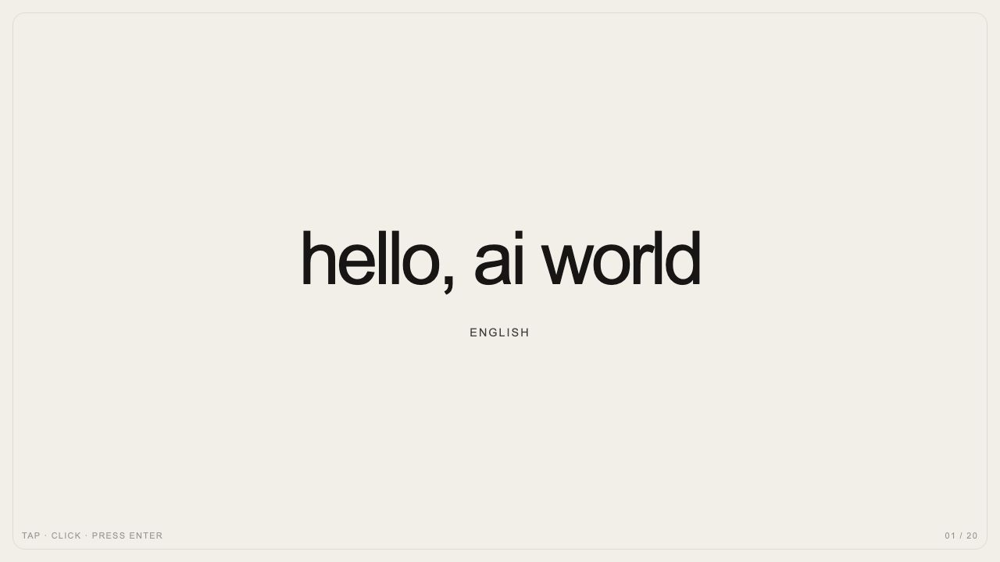

# hello-ai-world history

This file is generated from the immutable records in `releases/` and the linked cycle provenance. Newest release first.

## epoch-1 — Languages

Released 2026-08-30T15:00:11.308355Z. [`1385e9a`](https://github.com/shayliv/hello-ai-world/commit/1385e9af4fbfc4b7ba7d8a56f36f5c092e6edf8d) · [Open preserved version](https://hello-ai-world-mhbydmqmqq-ew.a.run.app/world/index.html)

> Turn “hello, ai world” into a quiet language portal. Each click or tap should reveal the greeting in another language with its native script and language name, while keeping the original minimal typography. Make the current greeting linkable through the URL hash. Use only self-contained HTML, CSS, and JavaScript with no network access.

Prompt by [@shayliv](https://github.com/shayliv); built by Codex session `01a0531e-c865-7750-8055-a11358570355`; classified by Codex session `01a05324-748d-78f1-98c2-4c2e411865c5`; promoted by [@shayliv](https://github.com/shayliv) in [PR #4](https://github.com/shayliv/hello-ai-world/pull/4).

## epoch-0 — Genesis

Released 2026-08-30T13:30:58Z. [`2a096c8`](https://github.com/shayliv/hello-ai-world/commit/2a096c825e932f9342ac57b38ef33352305fd568) · [Open preserved version](https://hello-ai-world-epoch0-mhbydmqmqq-ew.a.run.app/)

> Start with one dot: a simple HTML page and server saying hello, ai world.

Created by [@shayliv](https://github.com/shayliv) as the one-dot genesis.
